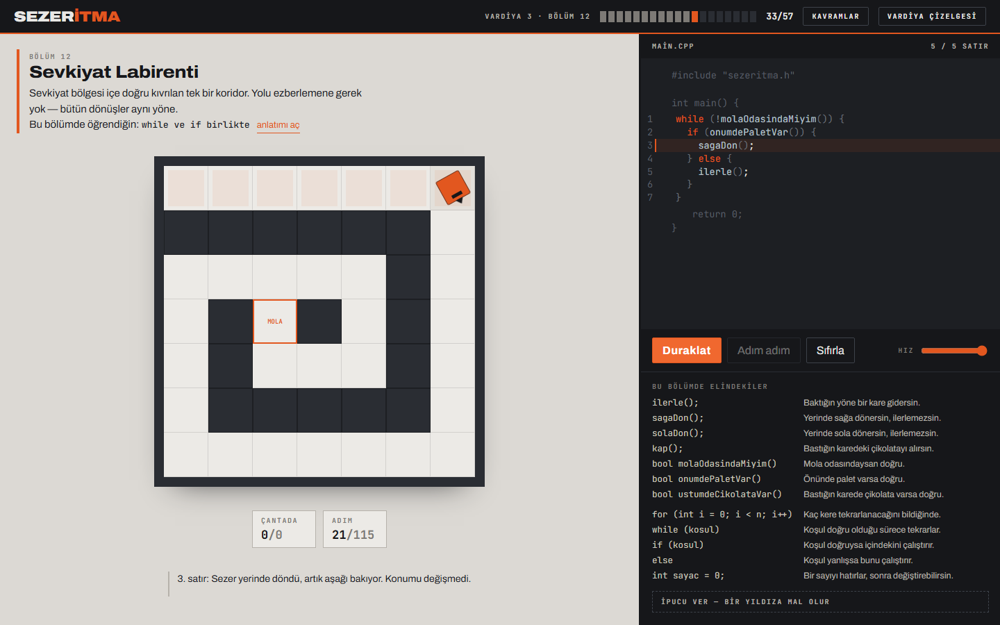

# Sezeritma

Bilgisayar mühendisliğine yeni başlayanlar için tarayıcıda çalışan, C++ ile algoritma öğreten oyun.

Öğrenci gerçek C++ kodu yazarak çikolata fabrikasındaki stajyer Sezer'i yönetir. Paletlerin arasından geçer, raflardaki çikolataları kapar, vardiya bitmeden mola odasına ulaşır. 16 bölüm boyunca sıralı çalışma, döngü, koşul, değişken ve fonksiyon kavramlarını **kodunun satır satır çalıştığını görerek** öğrenir.

Gerçek olaylardan esinlenilmiştir.



## Neden

Yeni başlayan öğrencinin asıl problemi sözdizimi değil, kodun zamanda aktığını görememesi. `for` döngüsünü ezberliyor ama "şu an 3. tur, `i` iki, karakter burada" resmini kafasında kuramıyor. Bu projenin tek işi o resmi ekrana koymak.

- **Kart modu** — ilk bölümlerde öğrenci hiç yazmıyor: komut kartlarına basıyor, C++ satırları editörde kendiliğinden beliriyor. Kod yazmayı bilmeyen biri ilk dakikadan itibaren doğru kodu görüyor, sadece yazma yükü kalkıyor. İstediği an "kendim yazayım" diyebiliyor.
- **Ders kartları** — her yeni kavram, ilk kullanıldığı bölümde anlatılıyor: önce hangi problemi çözdüğü, sonra nasıl çalıştığı, sonra satır satır açıklamalı bir örnek. Cevabı vermiyor, kavramı öğretiyor.
- **Adım anlatıcısı** — kod çalışırken her adımı cümleyle anlatıyor: *"4. satır: Sezer yerinde döndü, artık aşağı bakıyor. Konumu değişmedi."*
- **Kavram sözlüğü** — öğrenilen her kavram üst bardan her an açılabiliyor; unutunca geri dönülüyor.
- **Vardiya girişi ve özeti** — her bölümde ne öğreneceğini önce, ne öğrendiğini sonra söylüyor.
- **Aktif satır vurgusu** — kod çalışırken editörde işlenen satır boyanır. Döngünün başa dönüşü görünür hale gelir.
- **Değişken izleyici** — `int sayac = 0;` yazıldığı anda yan panelde `sayac: 0 → 1 → 2` akar.
- **Adım adım çalıştırma** — kod tek tek adımlanabilir, hız ayarlanabilir. Öğrenci hayatındaki ilk hata ayıklayıcıyı farkında olmadan kullanır.
- **Sezer'in izi** — geçtiği kareler zeminde iz bırakır, "nereye gitti" tek bakışta görünür.

Üçü de C++'ın öğrettiğimiz alt kümesini kendimiz ayrıştırıp kendimiz yürüttüğümüz için mümkün. Aynı sebeple hata mesajları da öğrencinin anlayacağı dilde:

> 3. satırın sonunda noktalı virgül eksik.
> 4. satırda palete çarptın. Sağa bakıyordun ve orada bir palet vardı — `onumdePaletVar()` ile önce kontrol etmeyi dene.
> `iflerle` diye bir komut yok. `ilerle` mi demek istedin?

Öğrenci bu yüzden kimsenin anlatmasına ihtiyaç duymuyor: kavram anlatılıyor, alıştırma yaptırılıyor, sonuç yorumlanıyor, öğrenilen geri dönülebilir halde duruyor.

## Müfredat

Beş vardiya, on dokuz bölüm. Her bölüm tek bir yeni fikir öğretiyor ve öncekini tekrar ettiriyor.

| Vardiya | Ne öğretiyor |
|---|---|
| 1 — Üretim Hattı | Komut, sıra, durum: bilgisayara adım adım iş anlatmak |
| 2 — İstif Deposu | Tekrarın problemi, `for`, döngü gövdesi, iç içe döngü |
| 3 — Sevkiyat Bölgesi | `while`, `if`, `if / else`, ve **algoritma** kavramının kendisi |
| 4 — Gece Vardiyası | Değişken, mantıksal koşullar, fonksiyon, sentez |
| 5 — Hata Ayıklama | Bozuk kodu okuyup düzeltmek: sınır hatası, sonsuz döngü, yanlış yerdeki satır |

Vardiya 5 tersine çalışıyor: kodu başkası yazmış ve bozuk. Öğrenci okuyor, çalıştırıyor, karşılaştırıyor, tek bir şey değiştiriyor. Gerçek bir programcının zamanının çoğu burada geçtiği için ayrı bir vardiya hak ediyor.

Son bölümün dersi şunu söylüyor: bütün bunlar aslında dört fikirdi — **sıra, tekrar, karar, isimlendirme.** Hangi dili öğrenirse öğrensin aynı dördünü görecek.

## C++'ın tören yükü

Öğrenci boş bir dosyaya bakmıyor. Editörde kilitli bir iskelet ve içinde kendi alanı var:

```cpp
#include "sezeritma.h"     // kilitli

int main() {               // kilitli
    ilerle();              // öğrencinin alanı
    ilerle();
    return 0;              // kilitli
}
```

`#include` ve `int main()` görünüyor — dersinde karşısına çıktığında yabancı gelmeyecek — ama onları yazmak zorunda değil. 15. bölümde `main()`'in üstünde ikinci bir düzenlenebilir bölme açılıyor ve fonksiyon kavramı orada öğretiliyor.

## Nasıl kurulur

```bash
npm install
npm run dev
```

| Komut | Ne yapar |
|---|---|
| `npm run dev` | Geliştirme sunucusu |
| `npm test` | Bütün testler (209 test) |
| `npm run bolum:dogrula` | Bölüm doğrulayıcı: her bölümü referans çözümüyle otomatik oynatır |
| `npm run bolum:gelen` | `docs/bolumler/` altındaki taslakları denetler, raporu `docs/gelen-bolum-raporu.md` dosyasına yazar |
| `npm run cevap-anahtari` | Bütün bölümlerin doğrulanmış çözümlerini `docs/cevap-anahtari.md` dosyasına üretir |
| `npm run typecheck` | Tip kontrolü |
| `npm run build` | Yayın derlemesi |

## Bölüm yazmak

Bölümler `src/levels/bolumler/` altında düz metin dosyaları. Bölüm yazmak için React, TypeScript ya da motor hakkında hiçbir şey bilmek gerekmiyor:

```
## Harita
######
#S..M#
######
```

`S` Sezer · `C` çikolata · `M` mola odası · `#` palet · `.` zemin

Biçimin tamamı ve kuralları [docs/bolum-formati.md](docs/bolum-formati.md) dosyasında. Yazdıktan sonra `npm run bolum:dogrula` bölümün gerçekten çözülebildiğini, boş kodla geçilemediğini ve hedef satır sayısının tutarlı olduğunu söylüyor.

## Nasıl çalışıyor

Öğrencinin kodu dört aşamadan geçiyor:

1. **Sözcüklere ayır** — her token'ın satır ve sütunu tutulur.
2. **Ayrıştır** — özyinelemeli inişli ayrıştırıcı sözdizimi ağacını kurar; sözdizimi hatası burada Türkçe ve satır numaralı yakalanır.
3. **Adım adım yürüt** — ağaç tek tek adımlanır. Her adımda hangi satırdayız, değişkenler ne durumda, Sezer nerede.
4. **Oynat** — adımlar arayüze akar; ızgara animasyonu, satır vurgusu ve değişken paneli aynı akıştan beslenir.

Tanıdığı C++ alt kümesi: `int`, `bool`, `for`, `while`, `if / else if / else`, `void isim() { }`, aritmetik ve karşılaştırma işleçleri. Tanımadığı her şey öğrenciye anlaşılır bir cümleyle söyleniyor.

Sonsuz döngü sayfayı kilitlemiyor: adım bütçesi dolunca "kodun hiç bitmedi" hatası veriliyor.

## Teknoloji

Vite · React · TypeScript · CodeMirror · Zustand · Vitest. Sözcük ayırıcı, ayrıştırıcı ve yürütücü sıfırdan yazıldı. Backend yok, veritabanı yok, üyelik yok. İlerleme tarayıcıda saklanır.

## Belgeler

| Belge | İçerik |
|---|---|
| [docs/baslangic.md](docs/baslangic.md) | Nereden başlanır, kim neyi yazıyor |
| [docs/tasarim.md](docs/tasarim.md) | Ürün, müfredat, teknik mimari, iş bölümü |
| [docs/bolum-formati.md](docs/bolum-formati.md) | Bölüm yazma biçimi ve kuralları |

## Sonraki sürüm

Bonus bölümler (parametreli fonksiyon, dizi, lineer arama), hareketli vardiya amiri, bölüm başına en kısa çözüm tablosu, ses.

## Ekip

- **Sedat** — sözcük ayırıcı, ayrıştırıcı, yürütücü, simülasyon, ızgara ve kod editörü
- **Sezer** — bölüm tasarımı, müfredat, Türkçe metinler, arayüzün panel tarafı
